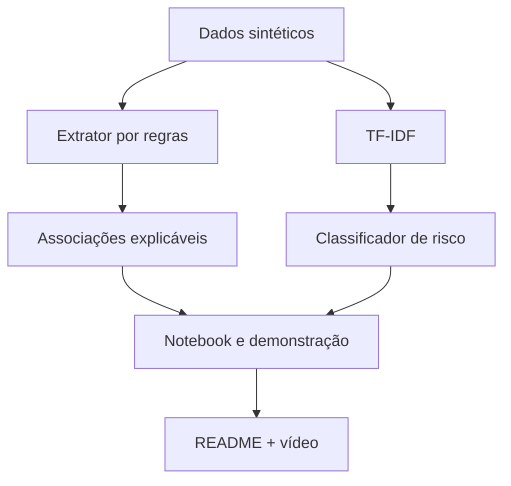

# Recursos, plugins, interfaces e arquitetura

## Princípio de execução

A entrega obrigatória será concluída e validada antes dos desafios opcionais. O núcleo de NLP não dependerá de serviços externos nem de dados clínicos reais.

## Recursos utilizados

| Recurso | Papel no projeto | Obrigatório? |
|---|---|---:|
| GitHub | fonte oficial, histórico, revisão por PR e entrega pública | sim |
| Python | geração de dados, extração e validação | sim |
| pandas | leitura e inspeção dos CSVs | sim |
| scikit-learn | TF-IDF, modelos, divisão e métricas | sim |
| Jupyter Notebook | narrativa executável e demonstração acadêmica | sim |
| matplotlib/seaborn | matriz de confusão e visualização | sim |
| unittest | testes automatizados sem dependência adicional | diferencial |
| YouTube não listado | vídeo demonstrativo de até 4 minutos | sim |
| React + Vite | portal visual do “Ir Além 1” | opcional |
| Keras | MLP para o “Ir Além 2” | opcional |

## Plugins e integrações

### GitHub

Usado para criar branches, revisar mudanças por Pull Request e integrar somente artefatos validados.

### Fluxo de dados e notebooks

Usado para estruturar os CSVs, verificar qualidade e manter o notebook reproduzível. Não depende de uma base externa.

### Interfaces visuais

Nenhum plugin visual é necessário na trilha obrigatória. Caso o portal opcional seja iniciado, a interface será construída em React + Vite e poderá usar recursos de design apenas para prototipação, sem misturar a UI com o pipeline de Machine Learning.

## Interfaces do projeto

### 1. Terminal

Executa a extração explicável:

```bash
python src/extrator_sintomas.py
```

### 2. Notebook

Apresenta carregamento, validação, TF-IDF, comparação de modelos, métricas, matriz de confusão, frases inéditas e limitações.

### 3. GitHub

Funciona como interface de entrega, documentação e navegação da equipe.

### 4. Portal React — implementado

Disponível em [CardioIA — Demonstração Acadêmica](https://cardioia-demo-fiap.fabriciomouzer2025.chatgpt.site). Recebe relatos sintéticos, apresenta achados explicáveis e reproduz no navegador a inferência da Regressão Logística validada. Não é prontuário nem sistema médico real.

## Arquitetura



## Decisões de qualidade

- dados inteiramente sintéticos;
- 45 expressões no mapa de conhecimento;
- 80 frases balanceadas no dataset inicial;
- agrupamento de frases semelhantes para evitar vazamento treino/teste;
- comparação de Regressão Logística e Árvore de Decisão;
- escolha orientada pelo recall de alto risco;
- testes de negação, múltiplos sintomas e ausência de correspondência;
- aviso explícito de que a saída não é diagnóstico.
