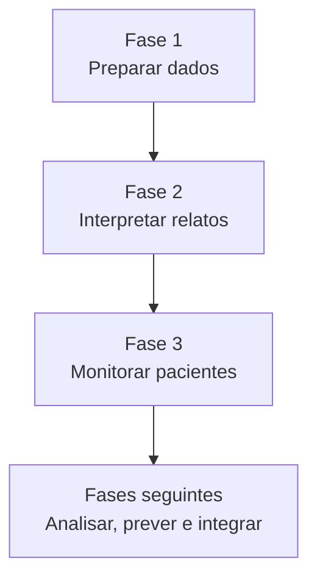
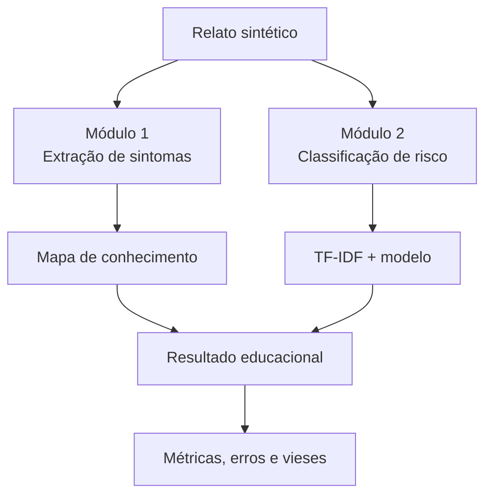

# CardioIA — Visão geral das Fases 1 e 2

Documento de orientação da equipe para compreender a evolução do projeto, localizar os artefatos e acompanhar o desenvolvimento da Fase 2.

> **Uso acadêmico:** o CardioIA é uma simulação educacional. Não realiza diagnóstico médico, não substitui profissionais de saúde e não deve ser utilizado em atendimentos reais.

## Equipe

| Integrante | RM |
|---|---:|
| Fabrício Mouzer Brito | RM566777 |
| Enzo Nunes Castanheira Gloria da Silva | RM567599 |
| Larissa Nunes Moreira Reis | RM568280 |
| Gabriel Rapozo Guimarães Soares | RM568480 |

## Visão geral do CardioIA

O **CardioIA: A Nova Era da Cardiologia Inteligente** é um projeto construído em etapas. Cada fase acrescenta uma nova capacidade ao ecossistema:

A lógica de evolução é:

**dados → organização → interpretação → classificação → monitoramento → apoio à decisão**

---

# Fase 1 — Batimentos de Dados

## O que foi a Fase 1

A Fase 1 construiu a base informacional do CardioIA. Antes de aplicar Inteligência Artificial, foi necessário demonstrar como diferentes tipos de dados poderiam ser coletados, organizados, documentados, protegidos e preparados para análises futuras.

A pergunta central foi:

> **Quais dados um sistema de cardiologia inteligente precisaria utilizar e como deveríamos organizá-los com responsabilidade?**

## O que produzimos

### 1. Dados estruturados

Foi criada uma base tabular sintética com:

- 150 registros;
- 17 variáveis;
- arquivo CSV;
- versão documentada em XLSX.

A finalidade foi representar informações organizadas de pacientes fictícios e preparar uma estrutura utilizável por modelos futuros.

### 2. Dados textuais

Foram criados dois exemplos de textos clínicos sintéticos para representar informações não estruturadas.

Esses textos prepararam o projeto para tarefas de Processamento de Linguagem Natural — NLP, que se tornam o foco principal da Fase 2.

### 3. Dados visuais

Foram produzidos:

- 100 imagens sintéticas de ECG;
- arquivos PNG organizados;
- manifesto para identificação e rastreabilidade;
- pacote ZIP com as imagens.

Esses materiais poderão apoiar atividades posteriores de classificação visual e redes neurais.

### 4. Governança e privacidade

A documentação registrou que:

- os dados são sintéticos;
- não foram utilizados prontuários reais;
- não existem identificadores pessoais;
- os rótulos possuem finalidade acadêmica;
- fontes, scripts, sementes e limitações devem ser rastreáveis;
- os artefatos não possuem validade diagnóstica.

### 5. Organização e documentação

O repositório reuniu datasets, planilhas, textos, imagens, documentação de governança, README, integrantes e evidências do trabalho. Os links públicos foram conferidos para garantir o acesso do professor.

## Resultado da Fase 1

A Fase 1 entregou o “combustível” do CardioIA:

> **Fase 1 = criação, organização e governança dos dados.**

---

# Fase 2 — Diagnóstico Automatizado: IA no Estetoscópio Digital

## O que será a Fase 2

Na Fase 2, o projeto deixa de apenas preparar dados e passa a analisá-los. Construiremos um protótipo capaz de interpretar relatos textuais sintéticos, identificar sintomas, consultar um mapa de conhecimento e classificar o nível de risco.

A pergunta central será:

> **Como a Inteligência Artificial pode interpretar um relato escrito e auxiliar em uma triagem inicial?**

## Mapa mental da Fase 2

## Módulo 1 — Extração de sintomas

### Relatos sintéticos

Criaremos um arquivo TXT com 10 relatos completos. Cada relato deverá informar:

- o que o paciente sente;
- quando o sintoma começou;
- intensidade ou evolução, quando aplicável;
- como o problema afeta sua rotina.

Exemplo:

> “Há três dias sinto falta de ar ao caminhar pequenas distâncias e precisei interromper minhas atividades domésticas.”

### Mapa de conhecimento

Criaremos um CSV relacionando sintomas, expressões equivalentes e possíveis associações.

| Sintoma | Expressão equivalente | Possível associação |
|---|---|---|
| dor no peito | pressão no peito | Angina |
| dor no peito | aperto no tórax | Infarto |
| falta de ar | dificuldade para respirar | Insuficiência cardíaca |
| palpitação | coração acelerado | Arritmia |
| fadiga | cansaço constante | Insuficiência cardíaca |

Embora o enunciado solicite uma estrutura simples, a meta é produzir aproximadamente 30 ou mais associações para ampliar os testes.

### Código de extração

O programa Python deverá:

1. abrir o arquivo com os relatos;
2. ler uma frase por vez;
3. normalizar maiúsculas, minúsculas e acentuação;
4. procurar sintomas e expressões equivalentes;
5. permitir múltiplos sintomas no mesmo relato;
6. consultar o mapa de conhecimento;
7. apresentar possíveis associações;
8. informar quando nenhuma correspondência for encontrada;
9. exibir um aviso de uso exclusivamente educacional.

## Módulo 2 — Classificação de risco

### Dataset de treinamento

Criaremos uma base sintética balanceada contendo:

- frases médicas simuladas;
- rótulos de baixo ou alto risco;
- diferentes formas de descrever sintomas semelhantes;
- variedade linguística suficiente para evitar repetições artificiais.

Exemplos:

| Relato | Rótulo esperado |
|---|---|
| Estou com forte dor no peito, suor frio e falta de ar. | alto risco |
| Senti um leve desconforto nas costas depois do exercício. | baixo risco |

### TF-IDF

O TF-IDF transformará as frases em vetores numéricos que possam ser processados pelos algoritmos.

O fluxo será:

**frase → tratamento do texto → TF-IDF → classificador → nível de risco**

### Modelos

A equipe pretende comparar:

- Regressão Logística;
- Árvore de Decisão.

O modelo final será selecionado considerando desempenho, estabilidade, interpretação e capacidade de reconhecer casos de alto risco.

## Avaliação do modelo

A análise não ficará limitada à acurácia. Serão apresentados:

- precision;
- recall;
- F1-score;
- matriz de confusão;
- falsos positivos;
- falsos negativos;
- comportamento diante de frases inéditas.

Os falsos negativos receberão atenção especial, pois representam relatos de alto risco classificados incorretamente como baixo risco.

## Vieses e limitações

Serão testadas situações como:

- negação: “não estou com dor no peito”;
- múltiplos sintomas;
- erros de digitação;
- expressões diferentes para o mesmo sintoma;
- intensidade e duração;
- frases ambíguas;
- desequilíbrio entre as classes.

O trabalho deverá reconhecer que palavras isoladas não determinam doenças, TF-IDF não compreende contexto como um profissional, bases pequenas produzem métricas instáveis e acurácia elevada não significa validade clínica.

---

# Entregáveis obrigatórios

1. TXT com 10 relatos completos;
2. CSV com o mapa de conhecimento;
3. código Python de extração de sintomas;
4. CSV com frases rotuladas por risco;
5. notebook com TF-IDF;
6. classificador treinado e testado;
7. métricas e análise dos resultados;
8. análise de erros, vieses e limitações;
9. README completo;
10. repositório público;
11. vídeo de até quatro minutos;
12. link do vídeo não listado no README.

## Barema — 10 pontos

| Critério | Pontos |
|---|---:|
| Relatos e mapa de conhecimento organizados | 2 |
| Código de extração funcional | 2 |
| Dataset simples criado corretamente | 1 |
| Classificador treinado e testado | 2 |
| Documentação e repositório público | 1 |
| Vídeo demonstrativo | 2 |

> O vídeo representa 20% da nota e deve ser tratado como entregável obrigatório.

---

# Diferenciais planejados

- mapa de conhecimento mais abrangente;
- dataset balanceado;
- comparação entre modelos;
- matriz de confusão;
- análise de falsos negativos;
- testes com frases inéditas;
- tratamento de múltiplos sintomas;
- testes automatizados;
- reprodutibilidade;
- governança e aviso de uso educacional.

## Atividades opcionais

### Ir Além 1 — Portal React

Após a conclusão da parte obrigatória, poderemos desenvolver uma interface com login simulado, proteção de rotas, pacientes fictícios, agendamentos e dashboard.

### Ir Além 2 — Rede neural para ECG

Também existe a possibilidade de treinar uma MLP para classificar ECGs como normal ou anormal. Essa frente só deve começar depois que os 10 pontos obrigatórios estiverem protegidos.

---

# Divisão inicial sugerida

| Frente | Responsabilidades | Responsável sugerido |
|---|---|---|
| Coordenação e integração | cronograma, GitHub, integração, README e entrega | Fabrício |
| Dados e conhecimento | relatos, sintomas, expressões e revisão do mapa | Enzo |
| NLP e Machine Learning | TF-IDF, modelos, métricas e notebook | Larissa |
| Testes e apresentação | frases inéditas, gráficos, roteiro e vídeo | Gabriel |

A divisão é operacional. Todos devem compreender e revisar o trabalho completo.

# Ordem de execução

## Etapa 1 — Preparação

- [x] organizar o repositório;
- [x] criar a pasta exclusiva da Fase 2;
- [x] preparar README, plano, governança e checklist;
- [x] preparar roteiro inicial do vídeo.

## Etapa 2 — Dados

- [ ] criar os 10 relatos;
- [ ] construir o mapa de conhecimento;
- [ ] criar o dataset de risco;
- [ ] revisar equilíbrio e variedade.

## Etapa 3 — Desenvolvimento

- [ ] programar a extração;
- [ ] aplicar TF-IDF;
- [ ] treinar e comparar modelos;
- [ ] organizar o notebook.

## Etapa 4 — Avaliação

- [ ] calcular métricas;
- [ ] gerar matriz de confusão;
- [ ] testar frases inéditas;
- [ ] analisar erros e vieses.

## Etapa 5 — Apresentação e auditoria

- [ ] finalizar o README;
- [ ] revisar integrantes e RMs;
- [ ] gravar o vídeo;
- [ ] publicar como não listado;
- [ ] inserir e testar o link;
- [ ] executar o projeto em ambiente limpo;
- [ ] entregar com antecedência.

# Status atual

- Fase 1 concluída e documentada;
- repositório público organizado;
- estrutura da Fase 2 criada;
- plano de execução disponível;
- governança e limitações documentadas;
- checklist do barema criado;
- roteiro inicial do vídeo preparado.

## Próximas ações

1. criar os 10 relatos completos;
2. montar o mapa de conhecimento;
3. criar o dataset de classificação;
4. iniciar o código de extração.

# Links

- [Repositório principal](https://github.com/FabricioMouzer/fiap-segundo-ano-2026)
- [Pasta da Fase 1](../../../fase-1/cardioia-batimentos-de-dados/)
- [Pasta da Fase 2](../)

# Resumo final

- **Fase 1:** construímos, organizamos e documentamos os dados do CardioIA.
- **Fase 2:** interpretaremos relatos, extrairemos sintomas e classificaremos o risco com Machine Learning.

O objetivo é apresentar uma evolução clara entre as fases e entregar uma solução acadêmica organizada, compreensível, reprodutível e responsável.
